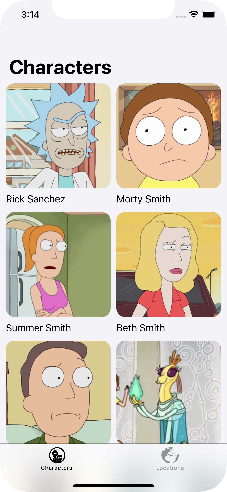
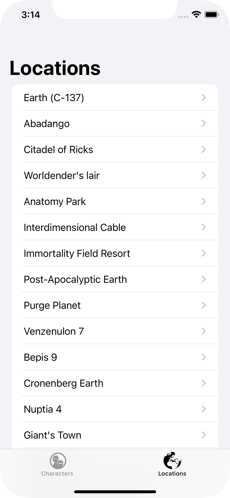
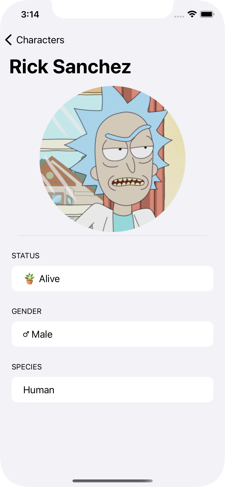
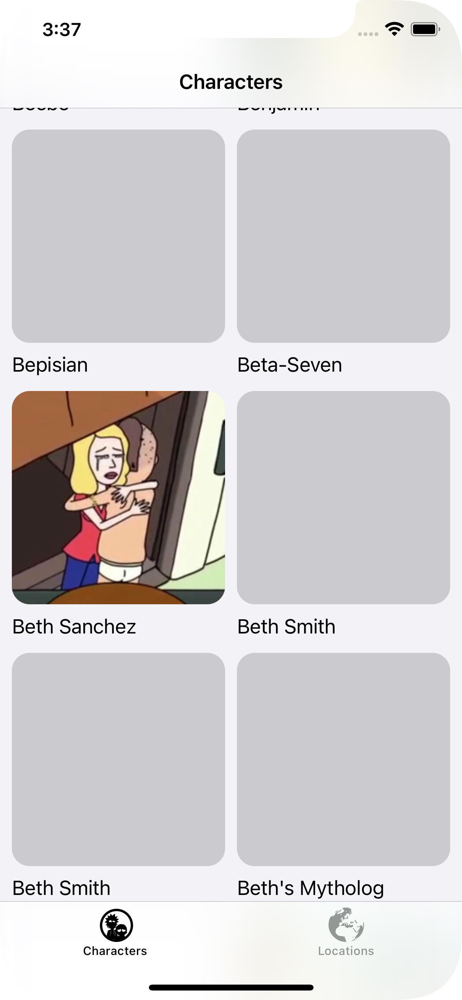
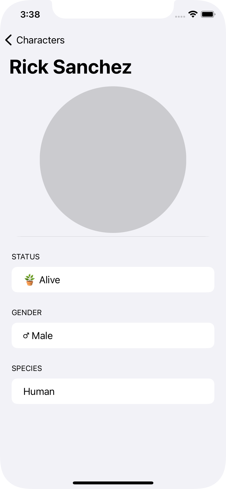
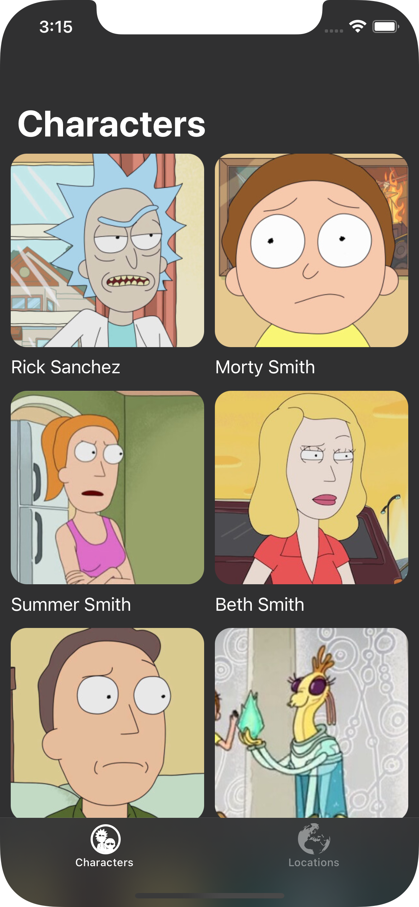
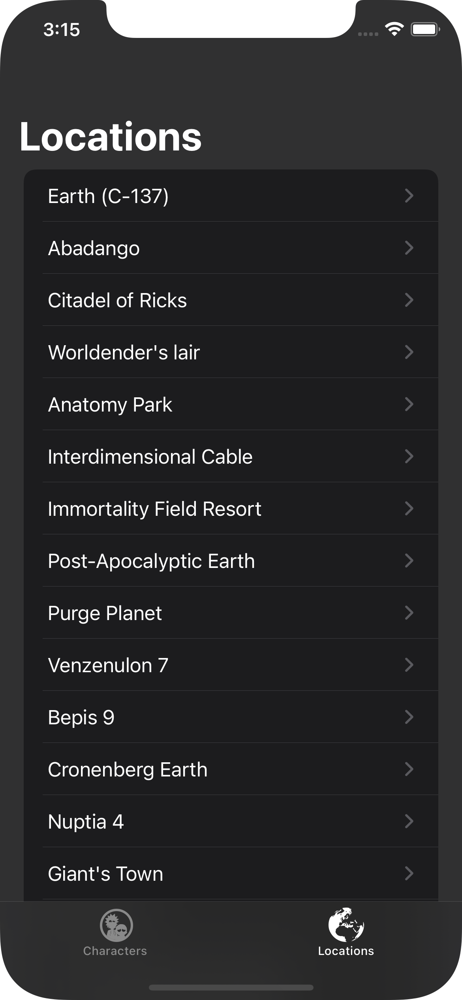

# Rick & Morty iOS


  

## Overview

This project makes use of the [Rick & Morty API](https://rickandmortyapi.com) to display all informations about the *Characters* and the *Locations* of the series. The app, entirely written with the [SwiftUI](https://developer.apple.com/xcode/swiftui/) framework, follows the MVVM architecture  and is intented to be a showcase of some powerful iOS development techniques.

  

## Features

#### Pagination 

New data are requested only when needed, in order to limit network requests.

 

#### Asynchronous Image Load

For a non-blocking app experience, images are loaded asynchronously and displayed only when they're ready.

 


#### Dark Mode

 

#### Memory safety

No longer visible images are freed up in order to save memory. Its usage remains almost constant.

 

#### GraphQL

The app uses the [GraphQL](https://graphql.org) technology in order to offer a lightwheight and powerful way to fetch the APIs. 

[Apollo](https://www.apollographql.com) client has been used for this project.

```graphql
query AllLocations($page : Int) {
    locations(page: $page) {
        info {
            next
        }
        results {
            id
            name
            type
            dimension
            residents {
                id
                name
                species
                type
                status
                gender
                image
            }
        }
    }
}
```

#### Extensive Use of Generics

The app makes a strong usage of generic types.

The model class `APIResponse`, which represents the response of a GraphQL query, is defined as shown below:

```swift
class APIResponse<T:Decodable> : Decodable {
    let info : Info
    let results : [T]
}
```

`ViewModel` class, which represent a generic view-model blueprint, is defined as shown below:

```swift
class ViewModel<T:Equatable> : ObservableObject, ViewModelProtocol {
    
    @Published var items : [T] = []
    var next : Int?
    
    func shouldLoad(_ item : T) {
        guard let last = items.last else {return}
        if item == last, next != nil {
            fetchMany()
        }
    }
    
    func fetchMany() { fatalError("Abstract Method") }

}
```

To perform a GraphQL query, there's only one exposed function: `perform<T, U>(query: T, completion: @escaping ((APIResponse<U>) -> ())) where T : GraphQLQuery, U : Decodable `, whose query and return type are defined at runtime.

Some examples of usage:

```swift
ApolloManager.perform(query: MyGraphQLQueryOne()) { (response : APIResponse<MyReturnDataOne>) in
		// Do something one
}

ApolloManager.perform(query: MyGraphQLQueryTwo(param: param)) { (response : APIResponse<MyReturnDataTwo>) in
		// Do something two
}
```


## To Do

- [ ] **Search Bar** to search characters and filter them by attributes 
- [ ] Include informations about **Episodes**
- [ ] **Tests**

<br/>

---

☕ **Antonio Pantaleo dev**
